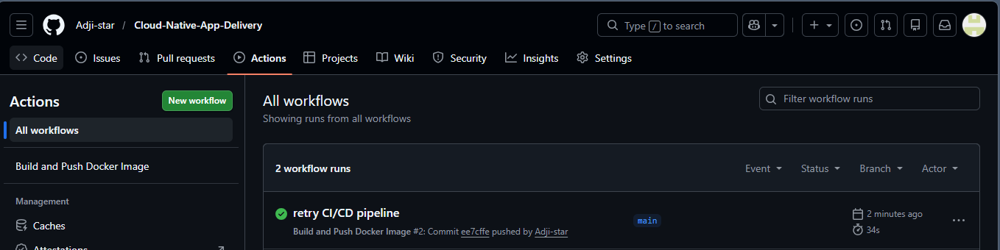
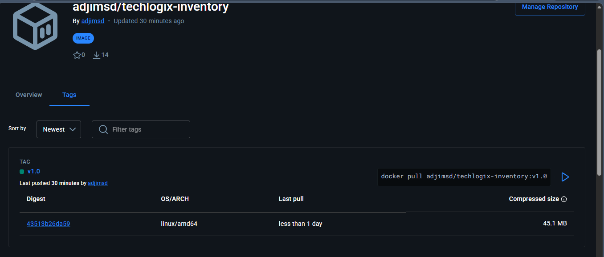
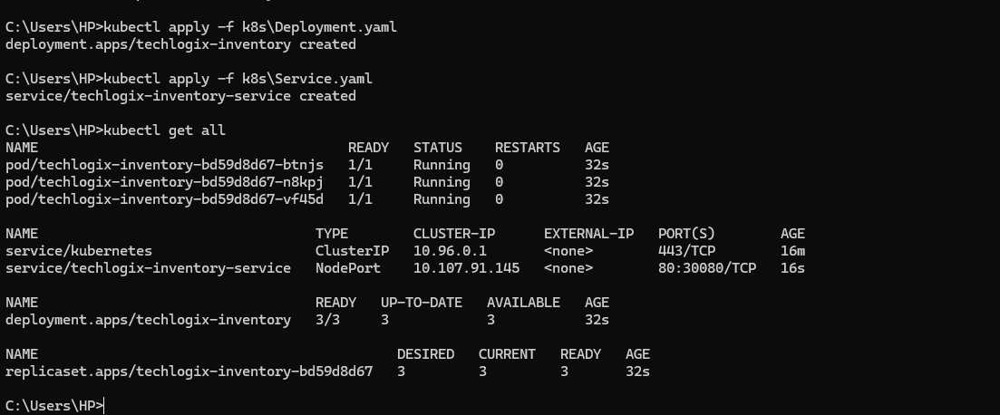
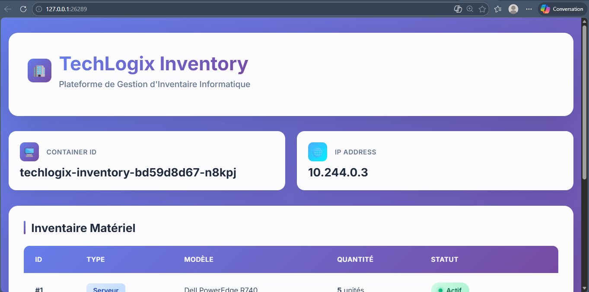

# Cloud-Native App Delivery — TechLogix Inventory

## Description
Application de gestion de stock conteneurisée et déployée sur Kubernetes via un pipeline CI/CD automatisé.

---

##  Lancer l'application en local avec Docker

### Prérequis
- Docker Desktop installé et démarré

### Commandes
```bash
# Cloner le dépôt
git clone https://github.com/Adji-star/Cloud-Native-App-Delivery.git
cd Cloud-Native-App-Delivery

# Construire l'image
docker build -t techlogix-inventory:v1.0 .

# Lancer le conteneur
docker run -d -p 3000:3000 --name inventory-app techlogix-inventory:v1.0

# Accéder à l'application
http://localhost:3000
```

---

##  Pipeline CI/CD (GitHub Actions)

Le pipeline se déclenche automatiquement à chaque `git push` sur la branche `main`.

### Étapes du pipeline
1. Checkout du code source
2. Connexion à Docker Hub via les secrets GitHub (`DOCKERHUB_USERNAME`, `DOCKERHUB_TOKEN`)
3. Build de l'image Docker
4. Push de l'image sur Docker Hub avec le tag `v1.0`

### Capture du pipeline réussi


### Image sur Docker Hub


---

##  Déploiement Kubernetes

### Prérequis
- Minikube installé et démarré
- kubectl configuré

### Commandes utilisées
```bash
# Démarrer le cluster
minikube start

# Appliquer les manifestes
kubectl apply -f k8s/Deployment.yaml
kubectl apply -f k8s/Service.yaml

# Vérifier l'état du cluster
kubectl get all

# Accéder à l'application
minikube service techlogix-inventory-service
```

### Capture kubectl get all


### Application dans le navigateur


---

##  Structure du projet
```
.
├── app/
├── .github/workflows/
│   └── docker-build.yml
├── k8s/
│   ├── Deployment.yaml
│   └── Service.yaml
├── Dockerfile
└── README.md
```